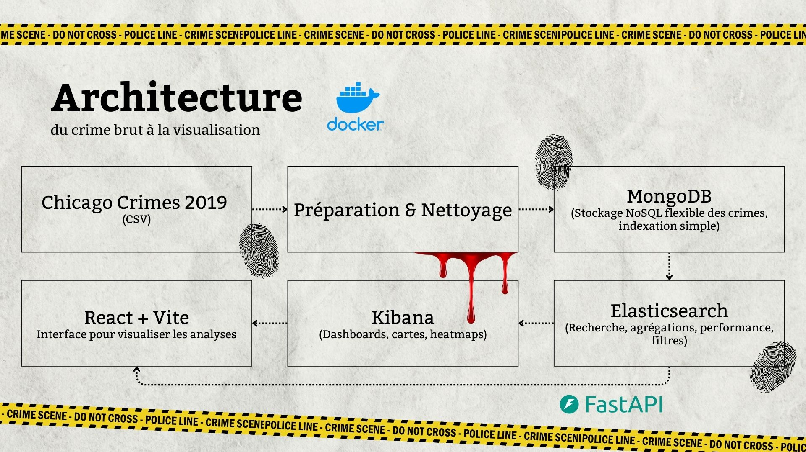

# 🏙️ Nahj Tribunal Monitor  
### Urban Crime Analysis & Decision Support System  

---

## 📖 Overview  

**Nahj Tribunal Monitor** is a data-driven web platform designed to **analyze, search, and visualize urban crime incidents** using real-world open data.  
The platform allows users to explore crime patterns by **type, time, and location**, access **detailed incident information**, and analyze **spatio-temporal trends** through interactive dashboards.  

This project demonstrates a **modern NoSQL and Big Data architecture**, integrating **MongoDB**, **Elasticsearch**, **Kibana**, and a **FastAPI-based backend**, complemented by a lightweight **React web interface**.  

---

## 🎯 Project Objectives  

- Assess the **safety level of a city**  
- Identify **high-risk districts and zones**  
- Analyze **crime trends over time**  
- Provide **fast and relevant search capabilities**  
- Offer **interactive visual analytics** for decision-making  

---

## 🧠 Functional Features  

- Search crimes by:  
  - Crime type  
  - Keywords  
  - Date and time  
  - District / community area  
  - Geographic zone  
- View detailed information for each incident  
- Visualize crime statistics via **Kibana dashboards**  
- Explore spatial crime distribution using **interactive maps**  

---

## 📊 Dataset Description  

### Primary Dataset (Recommended)  

**Chicago Crimes Dataset (2024)**  
Source: City of Chicago – Open Data Portal  
🔗 [Crimes 2024 Dataset](https://data.cityofchicago.org/Public-Safety/Crimes-2024/w98m-zvie)  

**Key Advantages:**  
- Real, incident-level data  
- Clean and well-structured  
- Rich temporal and spatial attributes  
- Ideal for geospatial analysis and dashboards  

> Global datasets were avoided because they provide aggregated statistics, not individual incidents, which limits the analytical depth.  

---

## 🏗️ System Architecture  

### Global Data Pipeline  

The overall project architecture:  

  

---

## 🧩 Architecture Rationale  

| Component | Purpose |
|-----------|---------|
| **MongoDB** | Flexible storage for enriched crime documents |
| **Elasticsearch** | High-performance full-text and geospatial search |
| **Kibana** | Interactive dashboards and visual analytics |
| **FastAPI** | High-performance REST API for backend |
| **React** | Lightweight and responsive web interface |
| **Docker** | Reproducible and portable deployment |

---

## 🧪 Data Enrichment & Feature Engineering  

Before ETL, the dataset is **enriched to enhance analysis**:  

- ⏱️ Hour extracted from timestamp  
- 📅 Day, month, and year extraction  
- 👥 Estimated number of victims  
- 🏷️ Crime category normalization  
- 🌍 Coordinate validation and formatting  

**Benefits:**  
- Advanced temporal analysis  
- Enhanced dashboards  
- Improved search and filtering accuracy  

---

## 🔄 ETL Process  

### ETL Script: `etl_crimes.py`  

**Steps:**  
1. Load CSV data using **pandas**  
2. Remove irrelevant or noisy columns  
3. Normalize and enrich data  
4. Insert structured documents into **MongoDB**  
5. Index selected fields into **Elasticsearch**  

### MongoDB Document Example  
{
"case_id": "1234567",
"date": "2024-05-03T12:30:00",
"hour": 12,
"primary_type": "THEFT",
"description": "OVER $500",
"location_description": "STREET",
"latitude": 41.8781,
"longitude": -87.6298,
"district": "005",
"community_area": "43",
"victims_count": 1
}

---

## 🔍 Elasticsearch Index Mapping  
{
"mappings": {
"properties": {
"primary_type": { "type": "keyword" },
"description": { "type": "text" },
"district": { "type": "keyword" },
"community_area": { "type": "keyword" },
"date": { "type": "date" },
"location": { "type": "geo_point" }
}
}
}

---

## 📈 Kibana Dashboards  

The visualization layer provides interactive insights into urban crime patterns and includes:  

- 🌍 **Geographic Heatmap**: Visualizes crime density across the city  
- 📊 **Crime Distribution by Type**: Shows counts of different crime categories  
- 📉 **Temporal Evolution**: Tracks incident trends over time  
- 🔥 **Top 10 Most Affected Districts**: Highlights high-risk areas  

These dashboards allow for **quick and actionable insights** into crime behavior and trends.  

---

## 🌐 Backend API (FastAPI)  

### Available Endpoints  

- **Search Crimes**
GET /search?keyword=theft&district=05
- **Retrieve crime details**
GET /crime/{id}

### Backend Responsibilities  

- Query Elasticsearch for fast filtering and search  
- Fetch full documents from MongoDB  
- Serve structured JSON responses to the frontend  

---

## 🖥️ Web Interface  

### 🔎 Search Page  

- Multi-criteria filtering  
- Paginated results list  
- Quick access to incident details  

### 📄 Incident Detail Page  

- Complete crime description  
- Location map using Leaflet.js  
- Direct link to Kibana dashboards  

---

## 🐳 Deployment (Elasticsearch & Kibana)  

The project leverages **Docker** to deploy Elasticsearch and Kibana in a reproducible and isolated environment.  

- **Elasticsearch** runs as a single-node instance for storing and indexing crime data.  
- **Kibana** connects to Elasticsearch and provides interactive dashboards for visualization.  
- The services are orchestrated via **Docker Compose**, ensuring consistent setup across different machines.  
- Ports:  
- Elasticsearch: `9200`  
- Kibana: `5601`  

This deployment setup allows developers to **quickly start the entire stack** without manual configuration, ensuring a seamless workflow for data ingestion, search, and visualization.  

---

## ▶️ How to Run the Project  

To start and run the **Nahj Tribunal Monitor** project, follow these steps:  

1. **Start Elasticsearch and Kibana**
docker-compose up -d
2. **Run the ETL pipeline to load and enrich the crime data**
python etl_crimes.py
3. **Start the FastAPI backend**
uvicorn main:app --reload

After these steps, the backend API will be accessible at `http://localhost:8000` and Kibana at `http://localhost:5601`.  

---

## 🛠️ Technologies Used  

- **Python**  
- **Pandas**  
- **MongoDB**  
- **Elasticsearch**  
- **Kibana**  
- **FastAPI**  
- **React**  
- **Docker**  

---

## 📌 Conclusion  

**Nahj Tribunal Monitor** is a complete urban crime analysis system that transforms raw open data into actionable insights.  
Through a well-designed NoSQL architecture and interactive visualizations, the platform supports informed decision-making regarding urban safety and crime prevention.  
